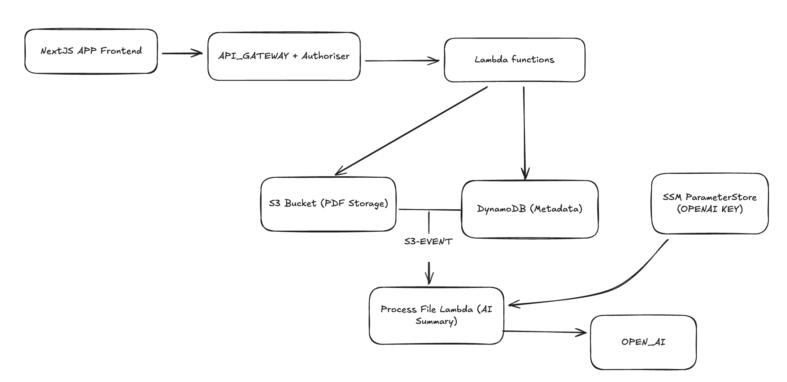

# Asterix - NHS Letter Processing System

A serverless application for uploading, processing, and summarizing NHS letters using AI.

🔗 **Live Demo:** [https://master.d1vexku8ke37lw.amplifyapp.com](https://master.d1vexku8ke37lw.amplifyapp.com)

## Architecture Overview



## Table of Contents

- [Getting Started](#getting-started)
- [Architecture Overview](#architecture-overview)
- [System Design Choices](#system-design-choices)
- [Async Processing Pattern](#async-processing-pattern)
- [Tech Stack](#tech-stack)
- [API Endpoints](#api-endpoints)
- [Data Model](#data-model)
- [Future Improvements](#future-improvements)
- [AI Prompt Engineering](#ai-prompt-engineering)
- [Running Locally](#running-locally)

---

## Getting Started

1. Clone the repository
2. Navigate to the frontend directory:
   ```bash
   cd frontend
   ```
3. Create a `.env.local` file and set the API URL:
   ```env
   NEXT_PUBLIC_API_URL=https://4vkjbzlzdh.execute-api.us-east-1.amazonaws.com/Prod/
   ```
4. Install dependencies and run:
   ```bash
   npm install
   npm run dev
   ```

---

## System Design Choices

### 1. **Decoupled Upload and Processing**

- Upload returns immediately after storing the file
- AI summarization happens asynchronously via S3 event trigger

### 3. **DynamoDB with GSI Strategy**

- Partition key: NHS Number (`pk`)
- Sort key: Upload timestamp (`uploaded_at`)
- GSI on `date_partition` for efficient date-range queries
- This allows for efficient and flexible queries (getting a file by nhs_number and filtering by the date the letter has been uploaded)

### 4. **PDF Validation at Multiple Layers**

- Content-Type header validation
- File extension validation
- Magic bytes validation (`%PDF-` header) ensuring the file uploaded is indeed a pdf

### 5. **API Gateway with Lambda Authorizer**

- Centralised authorisation logic
- Token-based authentication
- **Why**: Consistent security across all endpoints; easy to extend with proper auth later

---

## Async Processing Pattern

The system uses an **event-driven architecture** for AI processing:

### Flow:

1. **Upload Request** → User uploads PDF via frontend
2. **Upload Lambda** → Validates PDF, extracts metadata, stores in S3, creates DynamoDB record with `status: "pending"`
3. **S3 Event** → Triggers Process Lambda on `ObjectCreated` event
4. **Process Lambda** → Reads letter body, calls OpenAI for summary, updates DynamoDB with `status: "processed"` and `summary`
5. **Frontend Polling** → UI shows processing status; user can refresh to see completed summary (Can be improved by adding a notification system for the user to be alerted when a summary is complete)

## Tech Stack

### Frontend

| Technology   | Purpose                         |
| ------------ | ------------------------------- |
| Next.js 16   | React framework with App Router |
| TypeScript   | Type safety                     |
| Tailwind CSS | Styling                         |
| Radix UI     | Accessible component primitives |
| shadcn/ui    | Component library               |

### Backend

| Technology          | Purpose                |
| ------------------- | ---------------------- |
| AWS SAM             | Infrastructure as Code |
| Node.js 22          | Lambda runtime         |
| API Gateway         | REST API with CORS     |
| Lambda              | Serverless compute     |
| S3                  | PDF file storage       |
| DynamoDB            | Metadata storage       |
| SSM Parameter Store | Secrets management     |
| OpenAI GPT-4o-mini  | AI summarization       |

---

## API Endpoints

| Method | Endpoint  | Auth | Description     |
| ------ | --------- | ---- | --------------- |
| POST   | `/upload` | Yes  | Upload PDF file |
| GET    | `/all`    | Yes  | Get all letters |

---

## Data Model

### DynamoDB Schema: `NHSLetters`

| Attribute      | Type   | Description                     |
| -------------- | ------ | ------------------------------- |
| `pk`           | String | NHS Number (partition key)      |
| `uploaded_at`  | String | ISO timestamp (sort key)        |
| `file_name`    | String | Original filename               |
| `letter_date`  | String | Date extracted from letter      |
| `letter_body`  | String | Extracted letter content        |
| `s3_key`       | String | S3 object key                   |
| `file_size`    | Number | File size in bytes              |
| `num_pages`    | Number | PDF page count                  |
| `status`       | String | "pending" or "processed"        |
| `summary`      | String | AI-generated summary            |
| `processed_at` | String | Processing completion timestamp |

### Global Secondary Indexes

- **ByUploadDate**: Query letters by upload date partition
- **ByLetterDate**: Query letters by letter date

---

## Future Improvements

### 🔐 Authentication & Login Page

**Current State**: The authorizer allows all requests; no login UI exists.

**Improvements Needed**:

1. **Add Login Page UI**

   - Create `/login` route with username/password form
   - Redirect unauthenticated users to login
   - Implement protected route wrapper

2. **Proper Token Validation**

   - Validate JWT signature in authorizer
   - Check token expiration
   - Implement token refresh flow

3. **User Management**

   - Replace hardcoded users with DynamoDB/Cognito
   - Add password hashing (bcrypt/argon2)
   - Implement role-based access control (RBAC)

4. **Session Management**
   - Implement secure httpOnly cookies
   - Add CSRF protection
   - Consider OAuth 2.0 / OpenID Connect

### 📊 Additional Features to Add

- PDF preview/download functionality
- Bulk upload support
- Export to CSV/Excel
- Letter categorisation/tagging
- Audit logging
- Rate limiting

---

## AI Prompt Engineering

### Current Prompt

The current summarization prompt is basic:

```javascript
{
  role: "system",
  content: "You are a medical document summarizer. Summarize the following NHS letter concisely, highlighting key information such as appointment details, medical instructions, and any required actions. Keep the summary under 200 words."
}
```

This could be improved by providing better context, and implementing an output validation, followin a predefined or configurable schema.

## Running Locally

### Prerequisites

- Node.js 22+
- AWS CLI configured
- AWS SAM CLI
- OpenAI API key

### Frontend

```bash
cd frontend
npm install
npm run dev
```

### Backend

PS: Docker must be installed on the machine

```bash
cd backend
sam build
sam local start-api
```

### Environment Variables

Create `.env.local` in frontend:

```env
NEXT_PUBLIC_API_URL=http://localhost:3001
```

---

## Potential bottlenecks

- OpenAI API rate limits
- Lambda cold starts
- DynamoDB scan operations

### Security Considerations

1. **Current gaps**: No auth enforcement, hardcoded credentials
2. **Improvements**: Encryption at rest, audit logging, access controls
